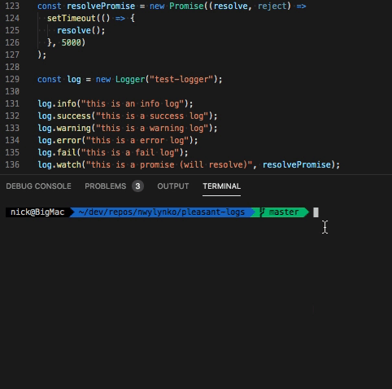

# pleasant-logs

Colourful nice logs for javascript

[](https://www.npmjs.com/package/pleasant-logs)

```bash
npm i pleasant-logs
```

```bash
yarn add pleasant-logs
```

```javascript

import Logger from 'pleasant-logs';

const log = new Logger('name');

log.info("hello world");

```

An unofficial port of <https://github.com/kkristof200/colored_logs>

Has bugs and not exactly the cleanest code, but if you'd like to work on it please fork it


